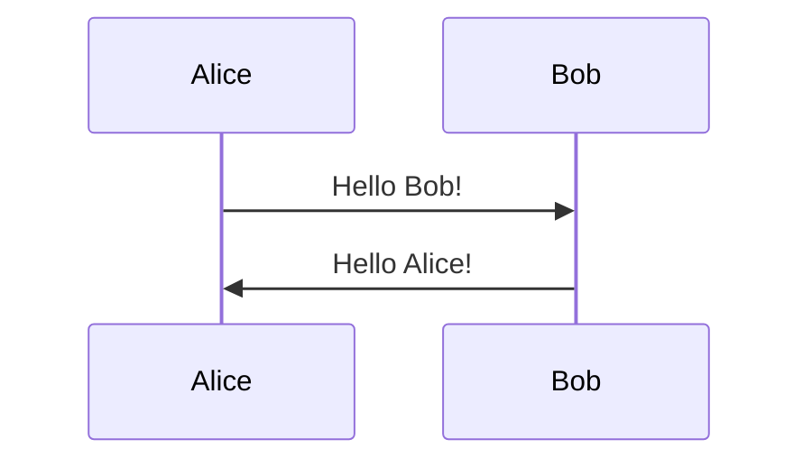

# Markdown Guide

Markdown is a lightweight markup language for creating formatted text using a plain-text editor.

## Basic Syntax

### Headers

```markdown
# H1 Header
## H2 Header
### H3 Header
#### H4 Header
##### H5 Header
###### H6 Header
```

### Emphasis

```markdown
*italic text* or _italic text_
**bold text** or __bold text__
***bold and italic*** or ___bold and italic___
~~strikethrough~~
```

### Lists

#### Unordered Lists

```markdown
- Item 1
- Item 2
  - Nested item 2.1
  - Nested item 2.2
- Item 3

* Alternative syntax
+ Also works
```

#### Ordered Lists

```markdown
1. First item
2. Second item
3. Third item
   1. Nested item
   2. Another nested item
```

#### Task Lists

```markdown
- [x] Completed task
- [ ] Incomplete task
- [ ] Another task
```

### Links

```markdown
[Link text](https://www.example.com)
[Link with title](https://www.example.com "Title text")
<https://www.example.com>
```

#### Reference Links

```markdown
[Link text][reference]

[reference]: https://www.example.com
```

### Images

```markdown


```

#### Image with Link

```markdown
[](https://www.example.com)
```

### Code

#### Inline Code

```markdown
Use `code` in your text.
```

#### Code Blocks

````markdown
```javascript
function hello() {
  console.log("Hello, World!");
}
```
````

#### Code Blocks with Line Numbers

````markdown
```javascript {1,3-5}
function example() {
  const x = 1;
  const y = 2;
  const z = 3;
  return x + y + z;
}
```
````

### Blockquotes

```markdown
> This is a blockquote
> It can span multiple lines

> Nested blockquotes
>> Use multiple arrows
```

### Horizontal Rules

```markdown
---
***
___
```

## Extended Syntax

### Tables

```markdown
| Header 1 | Header 2 | Header 3 |
|----------|----------|----------|
| Cell 1   | Cell 2   | Cell 3   |
| Cell 4   | Cell 5   | Cell 6   |
```

#### Table Alignment

```markdown
| Left align | Center align | Right align |
|:-----------|:------------:|------------:|
| Left       | Center       | Right       |
| Text       | Text         | Text        |
```

### Footnotes

```markdown
Here's a sentence with a footnote[^1].

[^1]: This is the footnote.
```

### Definition Lists

```markdown
Term
: Definition

Another term
: Another definition
: Second definition for the same term
```

### Emoji

```markdown
:smile: :heart: :thumbsup: :rocket:
```

Common emojis:
- :smile: `:smile:`
- :heart: `:heart:`
- :thumbsup: `:thumbsup:`
- :rocket: `:rocket:`
- :bug: `:bug:`
- :sparkles: `:sparkles:`
- :fire: `:fire:`
- :checkmark: `:checkmark:`

### HTML

Markdown supports inline HTML:

```markdown
<div align="center">
  
</div>

<details>
<summary>Click to expand</summary>
Hidden content here
</details>
```

### Badges

```markdown


```

## GitHub-Specific Features

### Mentioning Users and Teams

```markdown
@username
@organization/team-name
```

### Referencing Issues and Pull Requests

```markdown
#123
username/repository#123
```

### Keyboard Keys

```markdown
<kbd>Ctrl</kbd> + <kbd>C</kbd>
```

### Syntax Highlighting

GitHub supports syntax highlighting for many languages:

````markdown
```python
def hello():
    print("Hello, World!")
```

```ruby
def hello
  puts "Hello, World!"
end
```

```java
public class Hello {
    public static void main(String[] args) {
        System.out.println("Hello, World!");
    }
}
```
````

### Collapsible Sections

```markdown
<details>
<summary>Click to expand</summary>

## Heading
Content goes here

- List item 1
- List item 2

</details>
```

### Diagrams with Mermaid

````markdown



````

### Math Expressions

```markdown
Inline math: $E = mc^2$

Block math:
$$
\sum_{i=1}^{n} x_i = x_1 + x_2 + \cdots + x_n
$$
```

## Best Practices

1. **Use consistent heading hierarchy** - Don't skip heading levels
2. **Add blank lines** - Around headers, lists, code blocks, and other elements
3. **Use descriptive link text** - Avoid "click here" or bare URLs
4. **Optimize images** - Keep file sizes reasonable
5. **Use relative links** - For files in the same repository
6. **Keep lines short** - For better readability in plain text
7. **Use reference links** - For repeated URLs
8. **Add alt text to images** - For accessibility
9. **Use code blocks** - Instead of inline code for multi-line code
10. **Preview before committing** - Check how your markdown renders

## Common Mistakes to Avoid

- Forgetting blank lines around elements
- Not escaping special characters when needed
- Using HTML when markdown would work
- Inconsistent list markers
- Not indenting nested lists properly
- Mixing tabs and spaces
- Not using syntax highlighting for code blocks

## Resources

- [GitHub Markdown Guide](https://guides.github.com/features/mastering-markdown/)
- [Markdown Guide](https://www.markdownguide.org/)
- [CommonMark Spec](https://commonmark.org/)
- [GitHub Flavored Markdown Spec](https://github.github.com/gfm/)

## Tools

- [MarkdownLint](https://github.com/markdownlint/markdownlint) - Markdown linter
- [Grip](https://github.com/joeyespo/grip) - Preview GitHub markdown locally
- [VSCode Markdown Extensions](https://code.visualstudio.com/) - Various markdown tools
